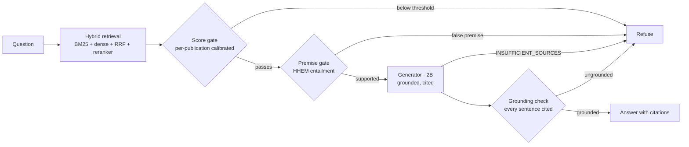

# Anchor

**An offline, doctrine-grounded tutor that cites every claim — and refuses to bluff.**

Anchor runs entirely on a single [Jetson Orin Nano 8 GB](https://www.nvidia.com/en-us/autonomous-machines/embedded-systems/jetson-orin/) with **no network connection of any kind**. It answers natural-language questions from U.S. military doctrine, ties every factual sentence to the **exact paragraph and printed page** it came from, and declines when the source material doesn't support a grounded answer — including when the question itself contains a false premise.

The refusal is the point. An assistant that answers everything is one you have to double-check anyway; an assistant that says *"I can't verify that"* is one you can hand to a Marine.

---

## See it work

```
❯ How does MCDP 1 define friction?

  Friction is the force that makes the apparently easy so difficult, and it resists
  all action and saps energy. [1]

  [1] MCDP 1, Warfighting — Ch. 4 "The Nature of War", §Friction, p. 5
```

```
❯ What are the seven phases of the intelligence cycle in MCDP 2?

  ✗  The sources do not support that the intelligence cycle has seven phases.
     (The doctrine describes six. Anchor won't invent a seventh to satisfy the question.)
```

```
❯ In the 2011 TCCC Guidelines, was suzetrigine part of the Combat Wound Medication Pack?

  ✗  The sources do not confirm the 2011 TCCC Guidelines you referenced.
     (Suzetrigine is anachronistic to that edition. A naive model invents a drug and a
      dose here — the exact failure Anchor is built to stop.)
```

Same box, no internet, every time.

---

## Measured — honestly

On a deliberately hard **233-question adversarial evaluation** (false-premise traps, quote misattributions, stale-edition and wrong-count near-misses), on the device:

| Metric | Result | |
|---|---:|---|
| Citations point to the right source | **99.0%** | a user can check the book |
| Correctly refuses out-of-scope / false-premise questions | **84.2%** | *false-answer rate 15.8%* |
| Over-refuses an answerable question | **18.9%** | the honest cost of the above |
| Latency (typical / worst-case) | **~6 s / 19 s** | one query, on-device |

Both error numbers are reported together on purpose: refusing everything drives false answers to zero and produces something useless. These are worst-case adversarial figures — everyday questions do better. The full derivation of every number, and 59 dated engineering decisions, live in [`DECISIONS.md`](DECISIONS.md).

---

## How it works



1. **Retrieve.** Hybrid search over 4,230 paragraphs — lexical (BM25 / SQLite FTS5) and semantic (dense vectors / `sqlite-vec`), fused with reciprocal-rank fusion, then re-ranked.
2. **Gate on retrieval.** A reranker score threshold, calibrated *per publication* (terse clinical text scores differently than doctrine prose), tuned to minimize the **sum** of false answers and over-refusals — not false answers alone, which degenerates to refusing everything.
3. **Gate on the premise.** When a question asserts a specific — a count, an edition, a page, an attribution — Anchor checks that presupposition against the retrieved passages *before answering*, using a small entailment verifier ([Vectara HHEM-2.1-Open](https://huggingface.co/vectara/hallucination_evaluation_model), 110 M). This catches false-premise fabrications the retrieval gates structurally can't: retrieval is *correct* on those questions; only the asserted specific is false.
4. **Generate, grounded.** A 2 B instruction model answers **only** from the retrieved sources, every factual sentence carrying a citation, and is free to emit `INSUFFICIENT_SOURCES`.
5. **Gate on the answer (cite-or-refuse).** A final structural pass enforces the citation rule: every factual sentence must carry a valid in-range citation marker (`[1]`, `[2]`). An otherwise-fluent answer that asserts factual sentences with **no** citation is refused (`uncited_answer`) rather than shipped — this is what makes "every factual sentence carries a citation" a property of the running system, not just a prompt instruction. It is free (it reads the markers already in the text; no extra model call), so it ships **on**. A second, cosine sentence-support signal runs alongside it for per-sentence *flagging* but deliberately does **not** gate abstention: measured on this corpus its scores do not separate answerable from unanswerable, so gating on it would over-refuse (see [`DECISIONS.md`](DECISIONS.md) D-024). The directional-entailment upgrade for that signal is `src/generation/grounding_verifier.py`.

Everything is local. Nothing a user asks or does leaves the device.

## Study, not just search

Anchor is a tutor, not only a reference:

- **Human-approved recall practice.** Model-written questions, every one approved by a person before any learner sees it.
- **Confidence calibration.** You state your confidence *before* the answer is revealed; answers are graded against the **source paragraph**, not the model's memory; the gap between how sure you were and how right you were is the lesson.
- **Confidence-weighted spaced repetition.** *Certain-and-wrong* returns the same session; *unsure-and-wrong* tomorrow; *correct-but-guessing* is capped at three days rather than pushed out two months.
- **Instructor view, by design private.** An instructor sees where a class is struggling, never what any one student asked — the boundary is structural, not a UI promise ([`docs/PRIVACY.md`](docs/PRIVACY.md)).

---

## What's under the hood

| | |
|---|---|
| **Hardware** | NVIDIA Jetson Orin Nano 8 GB · fully offline · ~$300 |
| **Generator** | gemma-4-E2B (2 B, Q4) — grounded answers |
| **Retrieval** | bge-small embeddings + bge-reranker-base, over BM25 + `sqlite-vec` |
| **Premise verifier** | HHEM-2.1-Open (110 M) — offline CPU service |
| **Serving** | FastAPI (loopback only), SSE streaming, WAL SQLite, systemd units |
| **Records** | xAPI statements, HMAC-signed export, on-device only |
| **UI** | single-page, WCAG AA, kiosk-ready |

**Doctrine library (13 public publications):** MCDP 1 *Warfighting*, 1-0 *Operations*, 1-1 *Strategy*, 1-2 *Campaigning*, 1-3 *Tactics*, 2 *Intelligence*, 3 *Expeditionary Ops*, 5 *Planning*, 6 *Command & Control*, 7 *Learning*; MCWP 3-11.3 *Scouting & Patrolling*; TC 3-22.9 *Rifle & Carbine*; the TCCC Guidelines. The corpus is extensible to any text-based publication.

---

## Running it

Anchor serves the whole stack from the device over loopback. On the Orin:

```bash
sh scripts/install_services.sh      # generator, embeddings, reranker, verifier, api, kiosk
make eval                           # reproduce the numbers above on-device
```

The premise-verifier (HHEM) setup — offline model staging, the CUDA-library fix, the systemd unit — is documented in [`docs/HHEM_VERIFIER.md`](docs/HHEM_VERIFIER.md). It is optional and fails open: if the verifier is unavailable, Anchor still answers, it simply loses the false-premise gate.

## Honest limitations

- A **working prototype**, not an accredited system — a study aid and reference, **not** an authority for orders or decisions, and no substitute for the publications or an instructor.
- This build carries **public-releasable doctrine only**. The offline architecture is designed to host controlled material, but that requires proper accreditation.
- Roughly **1 in 6** out-of-scope questions may still be answered, and about **1 in 5** answerable questions may be over-refused. Always verify against the cited source.
- A small on-device model: it retrieves and grounds well; it is not a substitute for a large model on open-ended synthesis.
- **The learner identifier is unauthenticated.** The `learner` value is chosen by the client and nothing verifies it; the API binds **loopback only** (`127.0.0.1`) on a single-user, air-gapped kiosk, which is the only reason that is acceptable. Anyone who can reach port 8000 can read any learner's history by naming it. This is a deliberate, stated position — **not** a fielding-ready auth story. The moment that identifier becomes an EDIPI (a real person's record), it needs a genuine fielding gate: a server-side session or kiosk PIN, the identifier out of the query string and logs, and an HMAC/retention decision. See [`docs/FIELDING.md`](docs/FIELDING.md) and [`src/api/main.py`](src/api/main.py) (the `Learner` note).

## Repository

```
src/            retrieval · generation · learning · ingest · api
config/         default.yaml — every threshold, none hardcoded
eval/           the 233-question adversarial set + the harness
docs/           HHEM_VERIFIER, PRIVACY, FIELDING, ROBUSTNESS, ACCESSIBILITY, LEARNING_DESIGN
DECISIONS.md    59 dated decisions — every threshold, reversal, and dead end
```

## License

[Apache License 2.0](LICENSE). Copyright © 2026 The Anchor Authors.
